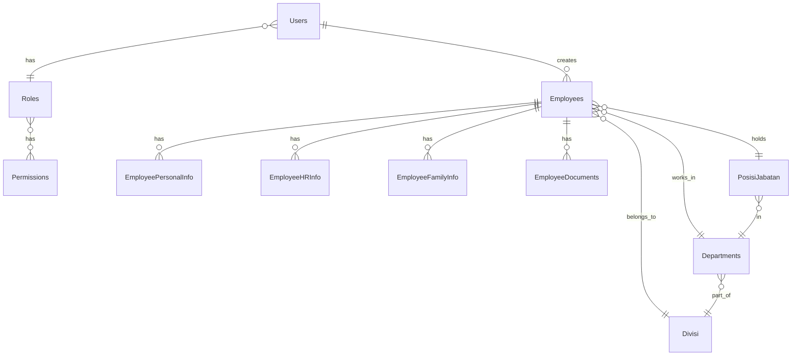

# Database Schema - Sistem Informasi SDM Bebang

## Overview
Database menggunakan PostgreSQL dengan Sequelize ORM. Total terdapat 25+ tabel yang diorganisir dalam beberapa modul.

## Entity Relationship Diagram



## Core Tables

### Users
Tabel autentikasi dan otorisasi pengguna sistem.

| Column | Type | Constraint | Description |
|--------|------|-----------|-------------|
| id | SERIAL | PRIMARY KEY | ID unik user |
| username | VARCHAR(100) | UNIQUE, NOT NULL | Username login |
| nik | VARCHAR(16) | UNIQUE | NIK karyawan terhubung |
| password | VARCHAR(255) | NOT NULL | Password (hashed bcrypt) |
| role_id | INTEGER | FOREIGN KEY → Roles | Role pengguna |
| is_active | BOOLEAN | DEFAULT true | Status aktif |
| created_at | TIMESTAMP | | Tanggal dibuat |
| updated_at | TIMESTAMP | | Tanggal update |

### Roles
Tabel peran/role untuk RBAC.

| Column | Type | Constraint | Description |
|--------|------|-----------|-------------|
| id | SERIAL | PRIMARY KEY | |
| name | VARCHAR(50) | UNIQUE, NOT NULL | Nama role (Admin, HR Manager, dll) |
| description | TEXT | | Deskripsi role |
| created_at | TIMESTAMP | | |

### RolePermissions
Tabel pivot untuk relasi many-to-many Roles ↔ Permissions.

| Column | Type | Constraint | Description |
|--------|------|-----------|-------------|
| id | SERIAL | PRIMARY KEY | |
| role_id | INTEGER | FOREIGN KEY → Roles | |
| resource | VARCHAR(50) | NOT NULL | Nama resource (EMPLOYEES, MASTER_DATA) |
| action | VARCHAR(20) | NOT NULL | Aksi (CREATE, READ, UPDATE, DELETE, EXPORT) |

**Index**: `(role_id, resource, action)` untuk performa query permission check.

## Employee Tables

### Employees
Tabel utama data karyawan.

| Column | Type | Constraint | Description |
|--------|------|-----------|-------------|
| id | SERIAL | PRIMARY KEY | |
| nomor_induk_karyawan | VARCHAR(16) | UNIQUE, NOT NULL | NIK (16 digit) |
| nama_lengkap | VARCHAR(255) | NOT NULL | Nama lengkap |
| foto_karyawan | VARCHAR(500) | | Path foto (uploads/) |
| department_id | INTEGER | FOREIGN KEY → Departments | |
| divisi_id | INTEGER | FOREIGN KEY → Divisi | |
| posisi_jabatan_id | INTEGER | FOREIGN KEY → PosisiJabatan | |
| atasan_id | INTEGER | FOREIGN KEY → Employees | Self-referencing FK |
| tanggal_bergabung | DATE | | |
| status_karyawan_id | INTEGER | FOREIGN KEY → StatusKaryawan | |
| is_active | BOOLEAN | DEFAULT true | |
| created_at | TIMESTAMP | | |
| updated_at | TIMESTAMP | | |

### EmployeePersonalInfo
Informasi pribadi karyawan.

| Column | Type | Constraint | Description |
|--------|------|-----------|-------------|
| id | SERIAL | PRIMARY KEY | |
| employee_id | INTEGER | FOREIGN KEY → Employees, UNIQUE | One-to-one |
| tempat_lahir | VARCHAR(100) | | |
| tanggal_lahir | DATE | | |
| jenis_kelamin | CHAR(1) | | 'L'/'P' |
| agama | VARCHAR(20) | | |
| no_telepon | VARCHAR(20) | | |
| email | VARCHAR(100) | | |
| alamat_ktp | TEXT | | |
| alamat_domisili | TEXT | | |
| npwp | VARCHAR(20) | | |
| no_bpjs_kesehatan | VARCHAR(20) | | |
| no_bpjs_ketenagakerjaan | VARCHAR(20) | | |
| created_at | TIMESTAMP | | |
| updated_at | TIMESTAMP | | |

### EmployeeHRInfo
Informasi kepegawaian/HR.

| Column | Type | Constraint | Description |
|--------|------|-----------|-------------|
| id | SERIAL | PRIMARY KEY | |
| employee_id | INTEGER | FK → Employees, UNIQUE | |
| jenis_hubungan_kerja_id | INTEGER | FK → JenisHubunganKerja | PKWT/PKWTT |
| kategori_pangkat_id | INTEGER | FK → KategoriPangkat | |
| golongan_id | INTEGER | FK → Golongan | |
| sub_golongan_id | INTEGER | FK → SubGolongan | |
| lokasi_kerja_id | INTEGER | FK → LokasiKerja | |
| nomor_sk_pengangkatan | VARCHAR(100) | | |
| tanggal_sk_pengangkatan | DATE | | |
| tanggal_kontrak_mulai | DATE | | |
| tanggal_kontrak_selesai | DATE | | |
| masa_kerja_tahun | INTEGER | COMPUTED | Dihitung otomatis |
| gaji_pokok | DECIMAL(15,2) | | |
| created_at | TIMESTAMP | | |
| updated_at | TIMESTAMP | | |

### EmployeeFamilyInfo
Data keluarga karyawan (pasangan).

| Column | Type | Constraint | Description |
|--------|------|-----------|-------------|
| id | SERIAL | PRIMARY KEY | |
| employee_id | INTEGER | FK → Employees, UNIQUE | |
| nama_pasangan | VARCHAR(255) | | |
| nik_pasangan | VARCHAR(16) | | |
| pekerjaan_pasangan | VARCHAR(100) | | |
| data_anak | JSONB | | Array objects: `[{nama, nik, tanggal_lahir}]` |
| data_saudara_kandung | JSONB | | Array objects |
| created_at | TIMESTAMP | | |
| updated_at | TIMESTAMP | | |

### EmployeeDocuments
Dokumen lampiran karyawan.

| Column | Type | Constraint | Description |
|--------|------|-----------|-------------|
| id | SERIAL | PRIMARY KEY | |
| employee_id | INTEGER | FK → Employees | |
| document_type | VARCHAR(50) | NOT NULL | 'KTP', 'IJAZAH', 'SK', dll |
| file_name | VARCHAR(255) | NOT NULL | Nama file asli |
| file_path | VARCHAR(500) | NOT NULL | Path storage |
| file_size | INTEGER | | Bytes |
| uploaded_by | INTEGER | FK → Users | |
| uploaded_at | TIMESTAMP | DEFAULT NOW | |

## Master Data Tables

### Divisi
| Column | Type | Constraint |
|--------|------|-----------|
| id | SERIAL | PRIMARY KEY |
| nama | VARCHAR(100) | UNIQUE, NOT NULL |
| kode | VARCHAR(20) | UNIQUE |
| created_at | TIMESTAMP | |

### Departments
| Column | Type | Constraint |
|--------|------|-----------|
| id | SERIAL | PRIMARY KEY |
| divisi_id | INTEGER | FK → Divisi |
| nama | VARCHAR(100) | NOT NULL |
| kode | VARCHAR(20) | |
| created_at | TIMESTAMP | |

**Constraint**: `UNIQUE (divisi_id, nama)` - Nama department unik per divisi.

### PosisiJabatan
| Column | Type | Constraint |
|--------|------|-----------|
| id | SERIAL | PRIMARY KEY |
| department_id | INTEGER | FK → Departments |
| nama | VARCHAR(100) | NOT NULL |
| kode | VARCHAR(20) | |
| is_management | BOOLEAN | DEFAULT false |
| created_at | TIMESTAMP | |

### StatusKaryawan
| Column | Type | Constraint |
|--------|------|-----------|
| id | SERIAL | PRIMARY KEY |
| nama | VARCHAR(50) | UNIQUE (Aktif, Cuti, Resign, dll) |

### JenisHubunganKerja
| Column | Type | Constraint |
|--------|------|-----------|
| id | SERIAL | PRIMARY KEY |
| nama | VARCHAR(50) | UNIQUE (PKWT, PKWTT) |

### Golongan, SubGolongan, KategoriPangkat, LokasiKerja, Tag
Struktur serupa dengan master data di atas.

## Audit & Logging

### AuditLogs
Mencatat semua perubahan data penting.

| Column | Type | Constraint | Description |
|--------|------|-----------|-------------|
| id | SERIAL | PRIMARY KEY | |
| user_id | INTEGER | FK → Users | Siapa yang melakukan |
| action | VARCHAR(20) | NOT NULL | CREATE/UPDATE/DELETE |
| entity_type | VARCHAR(50) | NOT NULL | 'Employee', 'Department' |
| entity_id | INTEGER | | ID record yang diubah |
| changes | JSONB | | Detail perubahan (before/after) |
| ip_address | VARCHAR(45) | | IP user |
| user_agent | TEXT | | Browser info |
| timestamp | TIMESTAMP | DEFAULT NOW | Kapan |

**Index**: `(entity_type, entity_id)`, `(user_id, timestamp)`, `(created_at DESC)`

## Indexes & Performance

### Critical Indexes
```sql
-- Employees
CREATE INDEX idx_employees_nik ON employees(nomor_induk_karyawan);
CREATE INDEX idx_employees_department ON employees(department_id);
CREATE INDEX idx_employees_active ON employees(is_active) WHERE is_active = true;

-- AuditLogs
CREATE INDEX idx_audit_entity ON audit_logs(entity_type, entity_id);
CREATE INDEX idx_audit_user_time ON audit_logs(user_id, timestamp DESC);

-- Users
CREATE INDEX idx_users_nik ON users(nik);
```

## Constraints & Business Rules

1. **NIK Unik**: `nomor_induk_karyawan` harus unik, 16 digit.
2. **Cascade Dropdown**: Department → Divisi, PosisiJabatan → Department.
3. **Self-Reference**: `atasan_id` harus karyawan aktif dengan `is_management = true`.
4. **Contract Dates**: Jika PKWT, `tanggal_kontrak_selesai` > `tanggal_kontrak_mulai`.
5. **Soft Delete**: `is_active = false` untuk karyawan yang resign (tidak dihapus fisik).

---
*Schema version: 1.0 (Updated: 2026-01-31)*
