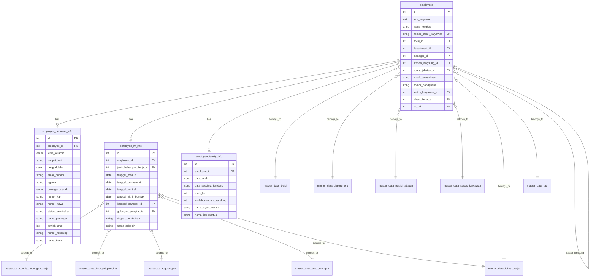

# Employee Database Schema

## Overview
This document describes the extended database schema for storing comprehensive employee information, including personal details, HR information, and family data.

## ER Diagram


## Tables

### 1. employees
Extends the basic employee table with references to master data and hierarchical relationships.

### 2. employee_personal_info
Stores personal biodata, identification numbers (KTP, NPWP, BPJS), addresses, and bank account information.

### 3. employee_hr_info
Stores employment details such as contract dates, educational background, rank/golongan, and emergency contacts.

### 4. employee_family_info
Stores family background including spouse, parents-in-law, and repeatable data for children and siblings using JSONB.

## JSONB Structures

### Data Anak
Stored in `employee_family_info.data_anak` as an array of objects:
```json
[
  {
    "nama": "String",
    "jenis_kelamin": "Laki-laki|Perempuan",
    "tanggal_lahir": "YYYY-MM-DD",
    "keterangan": "String"
  }
]
```

### Data Saudara Kandung
Stored in `employee_family_info.data_saudara_kandung` as an array of objects (max 5):
```json
[
  {
    "nama": "String",
    "jenis_kelamin": "Laki-laki|Perempuan",
    "tanggal_lahir": "YYYY-MM-DD",
    "pendidikan_terakhir": "String",
    "pekerjaan": "String",
    "keterangan": "String"
  }
]
```
